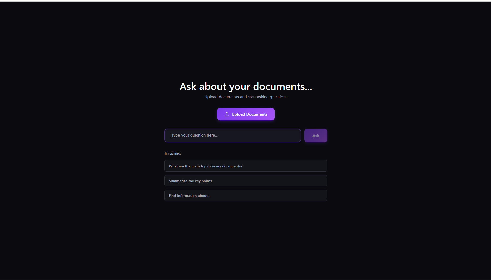
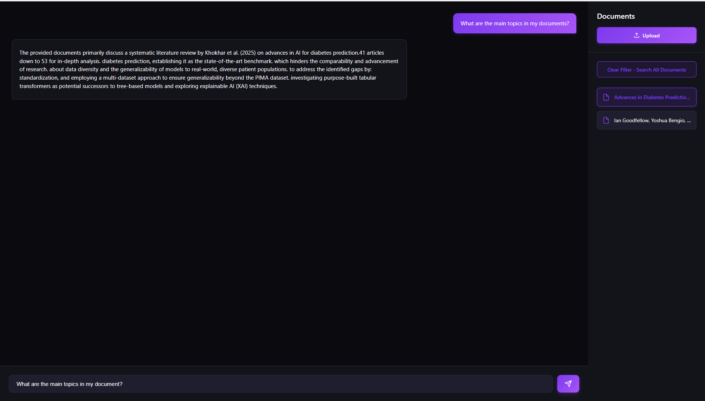

# Personal Search Engine

> **A production-grade, full-stack RAG system with advanced multi-stage retrieval, intelligent query routing, and hierarchical chunking — built using the Google Gemini Python SDK.**

[](https://www.python.org/)
[](https://fastapi.tiangolo.com/)
[](https://reactjs.org/)
[](https://www.postgresql.org/)

---

## 🎯 The Problem

Traditional RAG systems suffer from critical limitations: the **precision-context trade-off** (small chunks lose context; large chunks reduce retrieval accuracy), **semantic gaps** between queries and documents, **query ambiguity** (broad vs. specific questions need different strategies), and **poor UX** (synchronous processing blocks users).

## 💡 The Solution

This system implements a **multi-stage RAG pipeline** solving these through:

1. **Hierarchical Parent-Child Chunking** - Search small chunks, return full paragraphs
2. **Query Transformation (HyDe)** - Bridge semantic gaps via hypothetical document embeddings
3. **Intelligent Query Routing** - Route broad queries to summaries, specific queries to granular chunks
4. **Asynchronous Processing** - Non-blocking ingestion with Celery workers

---

## 🖼️ Quick Look

 

---

## ✨ Core Features

- **Parent-Child Hierarchical Chunking** - Precise retrieval + full context
- **HyDe Query Transformation** - Semantic gap bridging with hypothetical answers
- **Intelligent Query Routing** - Automatic broad vs. specific query handling
- **Asynchronous Processing** - Non-blocking document ingestion
- **Streaming Responses** - Real-time markdown rendering with SSE
- **Vector Storage** - PostgreSQL + pgvector for semantic search

---

## 🚀 Quick Start

### Prerequisites
- Docker & Docker Compose (recommended) OR Python 3.11+, Node.js 20+, PostgreSQL 16, Redis

### With Docker (Recommended)

```bash
git clone https://github.com/Fusion831/Personal-Search-Engine.git
cd Personal-Search-Engine

# Create .env with your credentials
cat > backend/.env << EOF
GOOGLE_API_KEY=your_key_here
POSTGRES_PASSWORD=secure_password
CELERY_BROKER_URL=redis://redis:6379/0
CELERY_RESULT_BACKEND=redis://redis:6379/0
EOF

# Start
docker-compose up --build

# Access
# Frontend: http://localhost:5173
# API Docs: http://localhost:8000/docs
```

### Manual Setup

**Backend:**
```bash
cd backend
python -m venv .venv
source .venv/bin/activate  # Windows: .venv\Scripts\activate
pip install -r requirements.txt
uvicorn main:app --reload
# In another terminal: celery -A worker.celery_app worker --loglevel=info
```

**Frontend:**
```bash
cd frontend
npm install
npm run dev
```

See [SETUP.md](docs/SETUP.md) for detailed instructions.

---

## 📚 Documentation

Comprehensive documentation in the [docs/](docs/) folder:

- **[ARCHITECTURE.md](docs/ARCHITECTURE.md)** - System design, workflows, and diagrams
- **[CONCEPTS.md](docs/CONCEPTS.md)** - Why parent-child chunking, HyDe, and intelligent routing
- **[PERFORMANCE.md](docs/PERFORMANCE.md)** - Latency breakdown and scalability
- **[ROADMAP.md](docs/ROADMAP.md)** - Future features ranked by priority
- **[SETUP.md](docs/SETUP.md)** - Complete installation guide

---

## 🛠️ Tech Stack

**Backend:** FastAPI, Celery, Redis, PostgreSQL 16, pgvector, SQLAlchemy  
**AI/ML:** Google Gemini SDK, Sentence-Transformers, pypdf  
**Frontend:** React 18, Vite, CSS Modules  
**DevOps:** Docker, Docker Compose, Nginx

---

## 📄 License

MIT License - see [LICENSE](LICENSE)

---

## 🤝 Contributing

Contributions welcome! Please open an issue first to discuss changes.

---

## 🙏 Acknowledgments

- Google Gemini team for the Python SDK
- Sentence-Transformers community
- FastAPI and PostgreSQL communities

---

**Built for precision. Engineered for scale. Designed for impact.**
